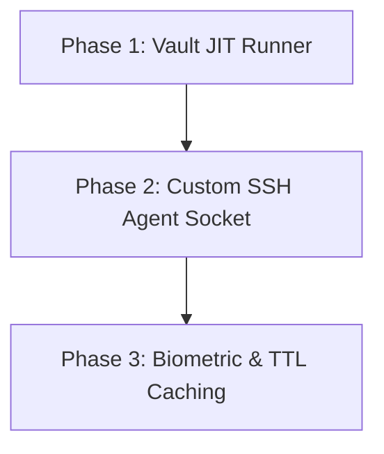

# Peer Review: Secure Gatekeeper Proposal

This document outlines architectural feedback and refinements for the [Design Proposal: Gitcore Secure Gatekeeper](../PROPOSAL_SECURE_GATEKEEPER.md).

---

## 1. Architectural Refinement: Custom SSH Agent Socket

### The Problem with Wrapping `git`
The original proposal suggests wrapping commands (e.g., executing `gitcore push/pull/fetch` instead of `git push`). This introduces high developer friction:
1. **Tooling Mismatch**: IDEs (VS Code, IntelliJ) and GUI Git clients (GitKraken, Sourcetree) invoke `git` or use `libgit2` directly. They do not know about `gitcore`, meaning their built-in sync/push buttons will break.
2. **Muscle Memory**: Developers are highly habituated to standard `git` CLI syntax.

### The Recommendation
Instead of wrapping the CLI commands, **`gitcore` should run as an SSH Agent daemon** using a local loopback socket.
1. The developer configures their shell with:
   ```bash
   export SSH_AUTH_SOCK=~/.gitcore/agent.sock
   ```
2. When `git` or an IDE triggers an SSH action, it queries the `SSH_AUTH_SOCK` socket.
3. The `gitcore` daemon intercepts the key request:
   * It prompts the user via TouchID/system keyring.
   * Decrypts the target SSH private key from the vault *in memory only*.
   * Signs the SSH challenge and returns the signature.
4. **Outcome**: The private keys never touch the filesystem, and all IDEs, GUIs, and standard terminals continue to work out of the box.

---

## 2. Mitigating Prompt Fatigue (In-Memory TTL Caching)

### The Problem
IDEs run periodic `git fetch` operations in the background. Prompting the user for master passwords or biometric scans every few minutes will lead to prompt fatigue, causing users to disable the security features.

### The Recommendation
The `gitcore` SSH Agent daemon should support a configurable **in-memory TTL (Time-To-Live)**.
* Once the vault is unlocked, the decrypted keys are cached strictly in the daemon's RAM.
* The keys automatically self-destruct (wiped from RAM) after a configurable inactivity window (e.g., 15 or 30 minutes).

---

## 3. Headless & Remote Environment Support

### The Problem
Headless servers, CI/CD runners, and remote development spaces (like Docker containers or VS Code Dev Containers) do not have GUI keychains or active terminal keyrings.

### The Recommendation
Introduce a fallback **Headless Mode** for non-interactive execution:
* Allow the agent to ingest a master password via a secure environment variable (e.g., `GITCORE_VAULT_PASSWORD`).
* If present, the agent automatically decrypts and serves the keys without triggering biometric/GUI prompts.

---

## 4. Suggested Implementation Phases



### Phase 1: Vault JIT Runner (MVP)
* Integrate the `keyring` crate for cross-platform secure store communication.
* Implement a command-wrapping JIT runner (`gitcore run -- <command>`) that creates a temporary standard `ssh-agent`, loads the decrypted key, runs the command, and destroys the agent immediately.

### Phase 2: Custom SSH Agent Socket
* Implement the SSH Agent protocol over local UNIX domain sockets (or Named Pipes on Windows).
* Allow IDEs and external tools to authenticate directly via the socket.

### Phase 3: Biometric & TTL Caching
* Add support for macOS TouchID, Windows Hello, and Linux PAM integrations.
* Add the background tick-timer to wipe RAM-resident keys once the TTL expires.
