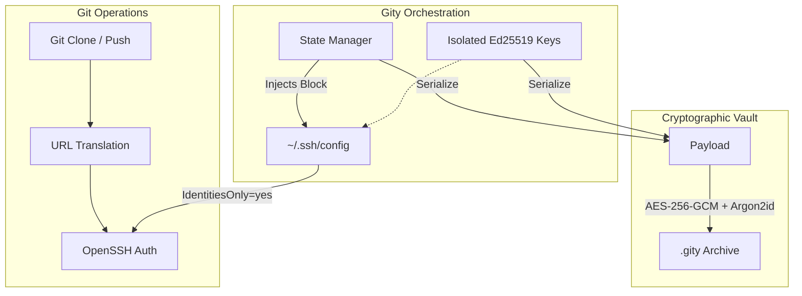

## The Problem: Identity Leakage

Standard Git and OpenSSH configurations are fundamentally designed for a single global identity. When developers juggle multiple contexts corporate environments, personal projects, and open-source contributions relying on globally scoped state (`~/.gitconfig` or a default `ssh-agent`) inevitably leads to "identity leakage." 

Commits are accidentally attributed to incorrect emails, or SSH authentication fails because the agent negotiates with the wrong private key. Existing workarounds rely on fragile shell scripts or error-prone manual configuration juggling. The objective was to engineer a robust, automated identity layer that entirely isolates these contexts.

## Architecture & Implementation

Gity is built as a statically linked Rust binary, prioritizing memory safety and zero external runtime dependencies.

### 1. Deterministic State Orchestration

To solve identity leakage, Gity bypasses global state by dynamically orchestrating OpenSSH behavior:

- **Strict Key Isolation**: Generates and manages isolated `Ed25519` keys for each context, ensuring the blast radius of any compromised credential is minimized.
- **Forced Routing**: Injects a strictly managed configuration block into `~/.ssh/config`. By mapping specific host aliases and enforcing `IdentitiesOnly yes`, Gity prevents SSH from attempting arbitrary key negotiation. It guarantees deterministic authentication.
- **Transparent URL Translation**: An internal Git module intercepts standard clone URLs (HTTPS, SSH, or shorthand) and rewrites them on the fly to route through the correct Gity-managed host alias.

### 2. Cryptographic Portability Constraint

A core engineering requirement was "Zero-Friction Portability" the ability to migrate entire development environments (configurations and private keys) between machines instantly, without relying on external system dependencies like `openssl` or `gpg`.

- **Authenticated Encryption**: The system bundles the identity state into a portable `.gity` vault, encrypted via **AES-256-GCM**. This provides both data confidentiality and cryptographic integrity against tampering.
- **Memory-Hard Key Derivation**: Master passwords are processed through **Argon2id**, defending the vault against offline brute-force and GPU-accelerated attacks.

### 3. Systems-Level Security Enforcement

Relying on shell-outs (e.g., executing `chmod` via subshells) is fragile and platform-dependent. 

Instead, Gity utilizes native OS system calls (via Rust's `std::os::unix::fs::PermissionsExt`) to programmatically enforce strict `0600` file permissions on all private keys and configuration files. This ensures strict compliance with OpenSSH security requirements while maintaining cross-platform reliability.

## System Architecture

## Impact

Gity transitions the management of multiple developer identities from a manual, error-prone chore into a robust, automated pipeline. By treating Git identities as secure, portable, and mathematically verifiable units, it completely eliminates identity leakage and reduces new environment setup time from hours to seconds.
