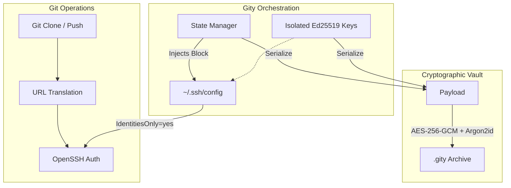

## The Problem: Identity Leakage

Standard Git and OpenSSH configurations are built for a single global identity. When juggling corporate, personal, and open-source contexts, relying on globally scoped state (`~/.gitconfig` or `ssh-agent`) inevitably leads to "identity leakage"—accidental commits with incorrect emails or authentication failures. The objective was to engineer a robust, automated identity layer that entirely isolates these contexts without relying on fragile shell scripts.

## Architecture & Systems Engineering

Gity is built as a statically linked Rust binary, prioritizing memory safety and zero external runtime dependencies. 

### 1. Deterministic State Orchestration
To solve identity leakage, Gity bypasses global state by dynamically orchestrating OpenSSH behavior. It generates isolated `Ed25519` keys and injects a strictly managed block into `~/.ssh/config`. By mapping specific host aliases, enforcing `IdentitiesOnly yes`, and rewriting clone URLs on the fly, Gity prevents arbitrary key negotiation and guarantees deterministic authentication.

### 2. The Cryptographic Portability Constraint
A core requirement was the ability to migrate entire development environments instantly without external dependencies like `openssl`. The system bundles the identity state into a portable `.gity` vault, secured via **AES-256-GCM** (authenticated encryption) and **Argon2id** (memory-hard key derivation) to defend against offline attacks.

### 3. Native Security Enforcement
Relying on shell-outs (like executing `chmod`) is fragile. Instead, Gity utilizes native OS system calls (`std::os::unix::fs::PermissionsExt`) to programmatically enforce strict `0600` file permissions on all private keys. This ensures absolute compliance with OpenSSH security requirements while maintaining cross-platform reliability.

## System Architecture



## Quick DX Showcase

To demonstrate the "Zero-Friction" workflow, here is how the orchestration feels in practice:

```bash
# 1. Add a dedicated work identity (generates key, updates ~/.ssh/config)
gity add work github

# 2. Gity intercepts the URL, configures authorship, and clones securely
gity clone work github.com/company/private-repo.git

# 3. All subsequent standard Git operations are now identity-aware automatically
git commit -m "feat: isolated push"
git push
```

## Impact

Gity transitions the management of multiple developer identities from an error-prone chore into a mathematically verifiable pipeline. It completely eliminates identity leakage, introduces graceful GPG signing integration, and reduces new environment setup time from hours to seconds through secure vaults.

---

**[📖 Read the full technical deep-dive and documentation in the GitHub Repository →](https://github.com/shedrackgodstime/gity)**

