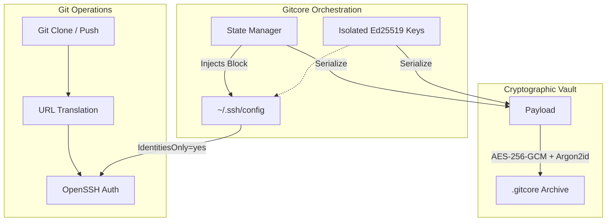

## The Problem

Most developers eventually need to manage more than one Git account — a work account, a personal one, an open-source identity. The default Git and SSH tooling was designed for a single global user, so running multiple accounts on the same machine quickly becomes a mess: commits go out under the wrong email, SSH authentication fails because the wrong key was offered, and setting everything up on a new machine takes an hour of manual config editing.

The goal was to build a tool that makes managing multiple accounts as simple as managing one — fully automated, no manual SSH config editing, no sticky notes.

## Architecture & Systems Engineering

Gitcore is built as a statically linked Rust binary with zero external runtime dependencies.

### 1. Deterministic Identity Routing
Each account gets its own isolated `Ed25519` SSH key. Gitcore injects a strictly managed block into `~/.ssh/config`, mapping each account to a unique host alias and enforcing `IdentitiesOnly yes`. This prevents OpenSSH from negotiating arbitrary keys — the right key is always used for the right account, automatically. Clone URLs (HTTPS, SSH, or shorthand) are rewritten on the fly to route through the correct alias.

### 2. Encrypted Portable Vault
A key requirement was zero-friction migration between machines — with no dependency on external tools like `openssl`. The entire identity state (config + all private SSH keys) is bundled into a single `.gitcore` file, secured via **AES-256-GCM** (authenticated encryption) and **Argon2id** (memory-hard key derivation) to defend against offline attacks. Restoring a full environment on a new machine takes one command.

### 3. Native Security Enforcement
Rather than shelling out to `chmod`, Gitcore uses native OS system calls (`std::os::unix::fs::PermissionsExt`) to programmatically enforce `0600` file permissions on all private keys. This ensures compliance with OpenSSH security requirements without platform-dependent workarounds.

## System Architecture



## Try It Out

**Install**

Linux & macOS:
```bash
curl -fsSL https://shedrackgodstime.github.io/gitcore/install | sh
```

Windows (PowerShell):
```powershell
iwr https://shedrackgodstime.github.io/gitcore/ps | iex
```

**Then run:**
```
$ gitcore --help

Manage multiple Git accounts safely with SSH keys

Usage: gitcore <COMMAND>

Commands:
  add     Add a new git account (creates SSH key + config)
  list    List all configured accounts with usage instructions
  clone   Clone a repo using a specific account (auto-sets git config)
  test    Test SSH connection (e.g. gitcore test github-work)
  remote  Manage git remotes for repositories
  export  Export configuration (backup or migrate to another machine)
  import  Import configuration from a file or stdin
  remove  Remove an account from gitcore config
  audit   Run security audit (file permissions, key protection, etc.)
  rotate  Rotate SSH key for an account (regenerate + show new public key)

Options:
  -h, --help     Print help
  -V, --version  Print version
```

## Impact

Gitcore removes the entire category of "wrong account" mistakes from a developer's workflow. Work and personal accounts stay completely isolated, switching between them requires zero manual effort, and migrating to a new machine takes seconds instead of an hour. It also includes optional GPG commit signing integration, a security audit command, and a CLI that guides you through setup interactively from the very first run.

---

**[📖 Full documentation and technical deep-dive →](https://github.com/shedrackgodstime/gitcore)**
